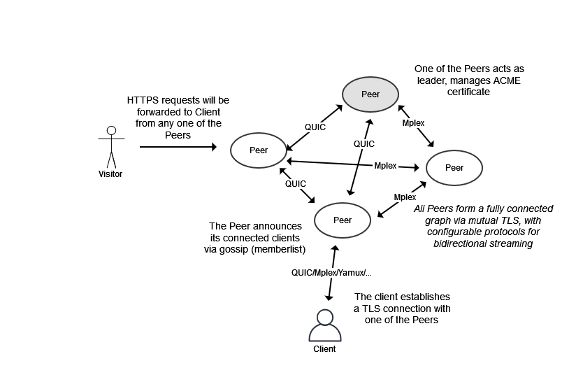

# What is `t`?

Another weekend project.

In short, this is like ngrok, or like [so many other tunneling softwares](https://github.com/anderspitman/awesome-tunneling) out there. But I got bored, so here we are.

*WARNING: NO TESTS, NO LUBE, WORKS FOR ME, USE AT YOUR OWN RISK*

# Configuration

See `example.config.yaml` for reference. You will need to generate your own CA and peer certificates. However, client/gateway TLS will be issued via Let's Encrypt, so there will be no need for configurations on the client side.

# How It Works

`t` uses Hashicorp's:
- [memberlist](https://github.com/hashicorp/memberlist) for peer discovery, state synchronization (updating the peer graph), and failure detection.

`t` also uses the following for multiplexing:
- [tcp/go-mplex](https://github.com/libp2p/go-mplex)
- [tcp/yamux](https://github.com/hashicorp/yamux)
- [udp/QUIC](https://github.com/lucas-clemente/quic-go)

`t` supports these protocols for creating logical streams between peers and clients, and clients can be connected to any one of the peers, and the gateway on _any_ of the peers will route the HTTPS request to the client's forwarding port.

Because of the architecture, peers and clients can be connected to each other with different protocols. This allows for complex networking environments where some peers are not able to communicate via QUIC because of buggy cloud firewall configuration, while other peers are able to communicate via QUIC.

The peers have to be publicly accessible on the Internet (they are the gateway, after all).

# Architecture



# How to Use

1. First you need a publicly accessible host. You can run one for $5 a month or cheaper from your favorite cloud/vps providers;
2. Configure RFC2136 settings. This is for completing the `dns-01` challenge for Let's Encrypt as we will be requesting for wildcard certificate;
3. Configure the rest of `config.yaml`, then run the `server -config config.yaml` with your favorite manager (e.g. Systemd);
4. Run `client -where tunnel.example.com -forward 127.0.0.1:3000`, and you should see a FQDN hostname ready to be used to tunnel HTTPS request to your apps running locally.

# How to Build

```bash
# building the server
CGO_ENABLED=0 go build -tags 'osusergo netgo' -ldflags '-s -w -extldflags "-static"' -a -o bin/server ./cmd/server

# building the client
CGO_ENABLED=0 go build -tags 'osusergo netgo' -ldflags '-s -w -extldflags "-static"' -a -o bin/client ./cmd/client
 ```

This will build static binary ready for distribution.

# Bootstrapping your Tunnel Network

1. Configure your `config.yaml`, firewall rules, peer certificates, etc, then use Let's Encrypt staging environment on one node and start the server.
2. If it created a new account and requested a new certificate, your configuration is good to go!
3. Remove the `accounts.json` and `bundle.json`, as they are for testing only.
4. Change the Let's Encrypt dirctory to `production`, then start the first node again.
5. Depending on your DNS, it may fail authorization for the initial tries. However, once the cert has issued successfully, you can now start up other nodes one by one.
6. They will be synchronized on startup. The client and gateway now should see a valid certificate issued by Let's Encrypt.
7. You can run just one node as well. Clustering is optional.

# TODO

1. Write the damn tests
2. ~~Make `client` command less painful to use~~ now with `-where` auto discovery
3. Multi-peer support from the client for HA. The plumbing is there to support it.
4. Make leader determination and ACME management less painful